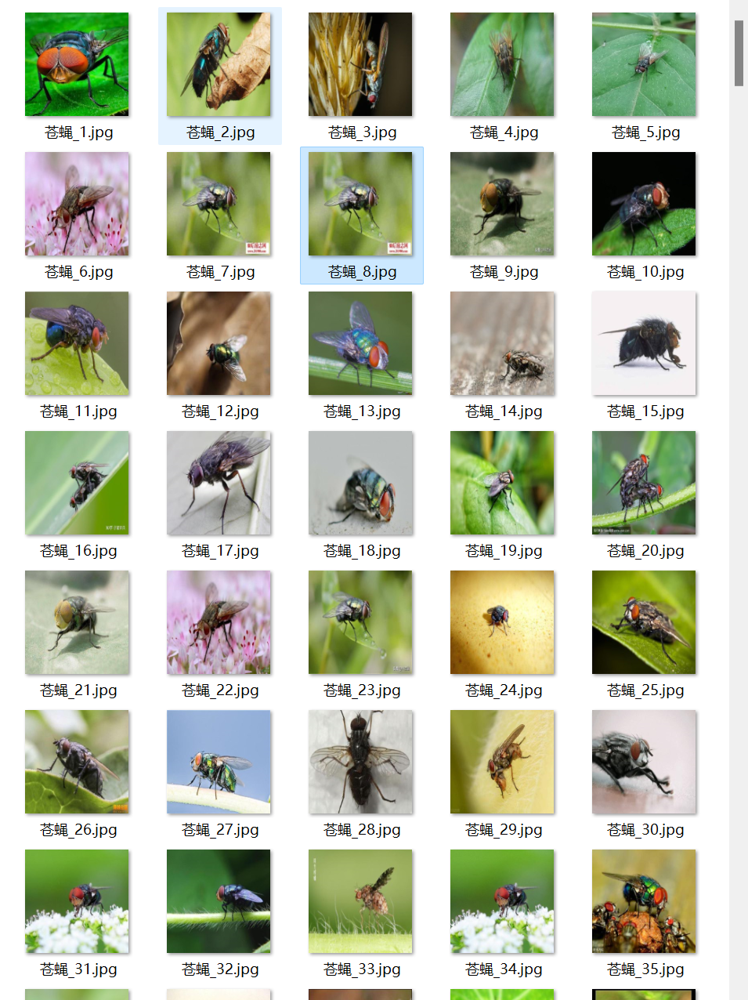
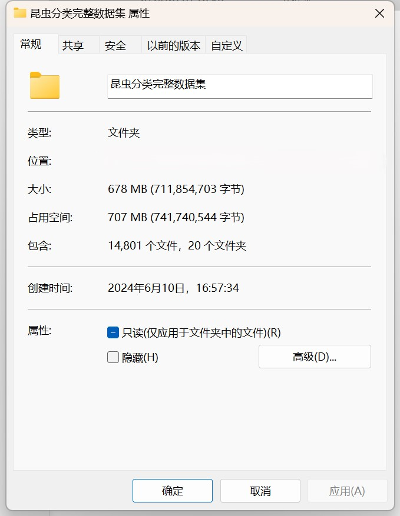
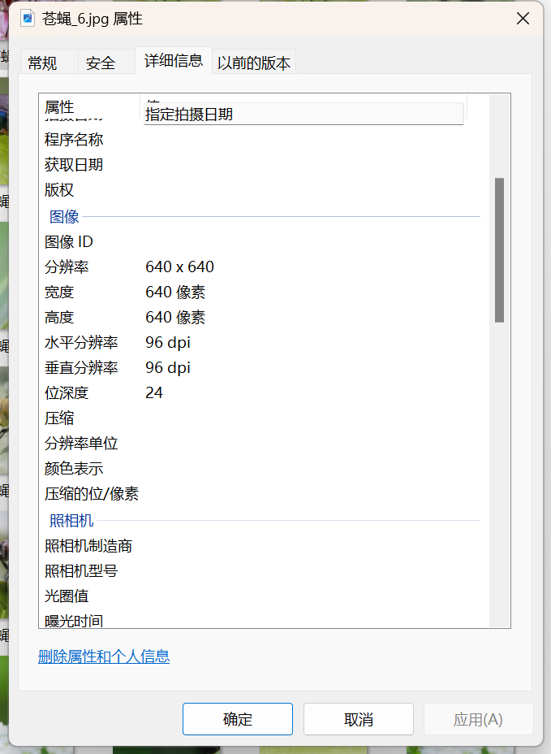

# 20 Insect Classification Dataset

Dataset Information Introduction: The number of images in folder "Cicada" is 516.
The number of images in folder "Cotton Bollworm" is 250.
The number of images in folder "Scutiger" is 480.
The number of images in folder "Pest" is 470.
The number of images in folder "Mite" is 1000.
The number of images in folder "Fly" is 512.
The number of images in folder "Ant" is 492.
The number of images in folder "Scorpion" is 557.
The number of images in folder "Snail" is 1000.
The number of images in folder "Spider" is 1000.
The number of images in folder "Bee" is 1000.
The number of images in folder "Dragonfly" is 1000.
The number of images in folder "Grasshopper" is 595.
The number of images in folder "Cicadas" is 1000.
The number of images in folder "Scorpion" is 1000.
The number of images in folder "Locust" is 1000.
The number of images in folder "Butterfly" is 1000.
The number of images in folder "Cricket" is 436.
The number of images in folder "Cockroach" is 493.
The total number of images in all subfolders is 14801.
Overall Screenshot:
For inquiries, please just ask. I don't require friend verification, so you can directly message me. I can see it.
If you search for me, send your question and intention all at once, and I will reply to you. Sometimes I am busy, so if you describe your problem and intention clearly when you are free, I will also reply to you.
I will reply to you when I am free as well, without needing formalities, which makes the efficiency higher.
Phone number is the same too, if I forget to reply or you are impatient, you can text or call me.

## Image

Here is a pay link on Stripe ( https://buy.stripe.com/3cs8yP7sY87d0vu9AB ). Please contact me lonlonago@foxmail.com after funding $89, and I will send you a complete data files , thank you!

